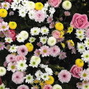

# natural_texture_synth
Based on Ashikhmin's 2001 paper, "Synthesizing Natural Textures".

Using this texture patch of flowers,

In this example, I use a kanji (Mu) as a target image,

And obtain with 1 pass and 15x15 size neighborhood.

The code for texture synthesis is in pure C++.
